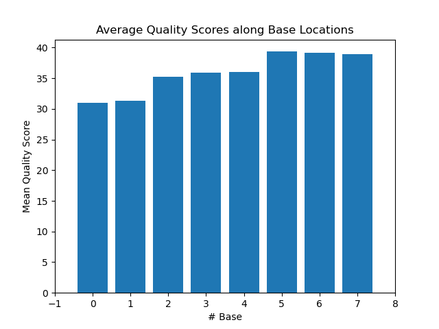
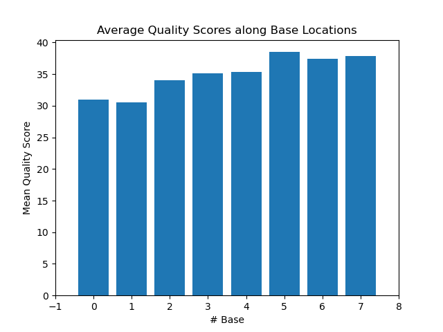
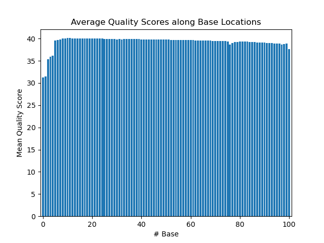
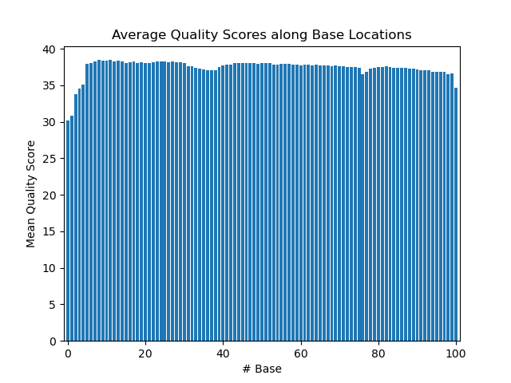

# Assignment the First

## Part 1
1. Be sure to upload your Python script.

| File name | label |
|---|---|
| 1294_S1_L008_R1_001.fastq.gz | read1 |
| 1294_S1_L008_R2_001.fastq.gz | index1 |
| 1294_S1_L008_R3_001.fastq.gz | index2 |
| 1294_S1_L008_R4_001.fastq.gz | read2 |

2. Per-base NT distribution
    1. Use markdown to insert your 4 histograms here.
    
    Index 1:
    
    
    
    Index 2:
    
    
    
    Read 1:
    
    
    
    Read 2:
    
    
    
    2. An average quality score of 30 for each index is a good cutoff. This ensures a 99.9% chance that the base calls are correct and will lessen the chance of incorporating more error in downstream data analysis.
    3. ```zcat 1294_S1_L008_R2_001.fastq.gz 1294_S1_L008_R3_001.fastq.gz | sed -n '2~4p' | grep -e "N" | wc -l```
    
        ```7304664```
    
## Part 2
1. Define the problem
2. Describe output
3. Upload your [4 input FASTQ files](../TEST-input_FASTQ) and your [4 expected output FASTQ files](../TEST-output_FASTQ).
4. Pseudocode
5. High level functions. For each function, be sure to include:
    1. Description/doc string
    2. Function headers (name and parameters)
    3. Test examples for individual functions
    4. Return statement
